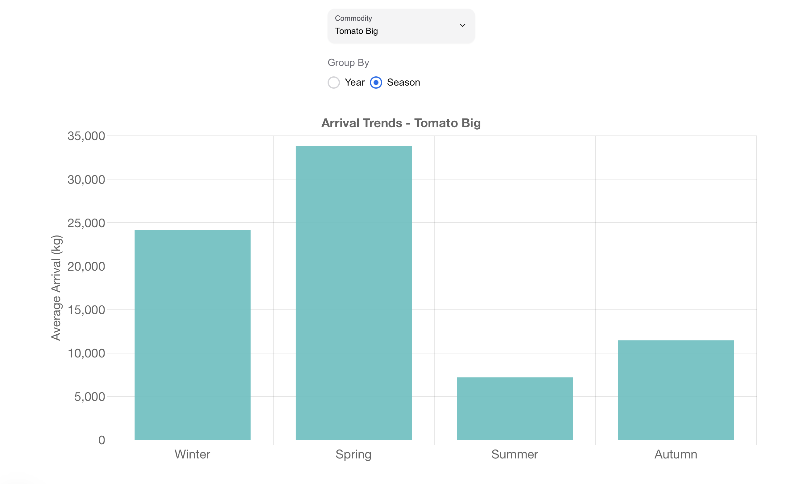

# Kalimati Data Visualization

This project is a dashboard showing various metrics from the Kalimati Vegetable Market dataset. Below are some screenshots of this web application.

## Homepage

### Detailed Price History

## Price Distribution

## Boxplot

## Price vs Arrival

## Arrival Trends

### Arrival Trends by Year

### Arrival Trends by Season

